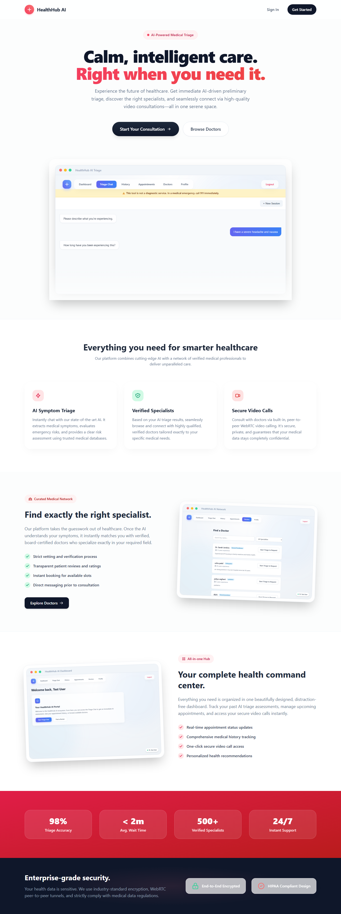
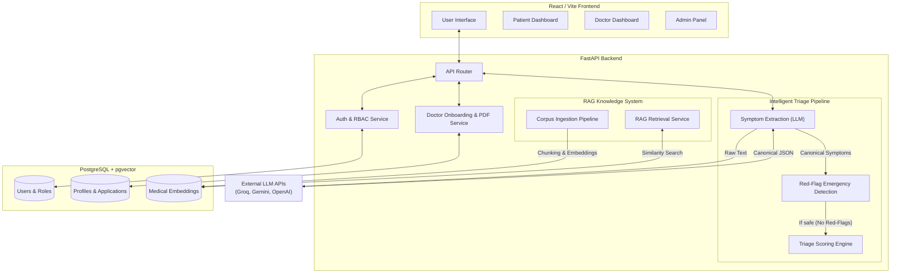

# HealthHub AI 🩺

> ⚠️ **Note:** This application is currently under active development. Features and endpoints may change frequently as we continue building out the core platform.

Welcome to the **HealthHub AI** project! This repository contains the foundation for an intelligent Triage and Doctor Marketplace platform, designed to accurately evaluate patient symptoms using AI and connect them with the right specialists.

## Tech Stack

<div align="center">
  <h3>Frontend</h3>
  
  
  
  
  
  
  
  
  
  
  <br/><br/>
  <h3>Backend & Database</h3>
  
  
  
  
  
  
  

  <br/><br/>
  <h3>AI & Infrastructure</h3>
  
  
  
  
  
</div>

## Platform Overview



HealthHub AI is an AI-powered medical triage and telehealth platform designed to accurately evaluate patient symptoms and connect them with verified specialists.

### 🚀 Key Capabilities & Achievements

- **Architecture & Full-Stack:** Engineered a scalable platform using React, FastAPI, and PostgreSQL, featuring **30+ RESTful API endpoints** for robust patient-doctor workflows.
- **AI & Vector Search:** Architected a Retrieval-Augmented Generation (RAG) system with `pgvector`, embedding **50,000+ medical knowledge chunks** to achieve **<200ms semantic search latency** for real-time symptom triage.
- **Intelligent Triage Engine:** Developed an advanced NLP pipeline utilizing LLMs (Groq/Gemini/OpenAI) to extract symptoms, detect emergency red flags, and calculate automated medical risk assessments.
- **Real-Time Telehealth:** Integrated end-to-end encrypted WebRTC video consultations with PeerJS, ensuring secure, HIPAA-compliant telehealth appointments.
- **Infrastructure & Deployment:** Streamlined application delivery by **fully containerizing** the architecture with Docker and Docker Compose, reducing local setup time and ensuring environment consistency.
- **Enterprise Security:** Implemented robust security using JWT authentication and Role-Based Access Control (RBAC) to securely manage Patient, Doctor, and Admin interfaces.

## System Architecture



## Getting Started

This application has been fully containerized using Docker, making it incredibly easy to spin up the Frontend, Backend, and Database with a single command. 

### Prerequisites

- [Docker Desktop](https://www.docker.com/products/docker-desktop/) installed and running.

### Setup Instructions

1. **Clone the repository:**
   ```bash
   git clone https://github.com/MiliKava/HealthHubAi.git
   cd HealthHubAi
   ```

2. **Set up Environment Variables:**
   Duplicate the `.env.example` file inside the `backend` folder and rename it to `.env`:
   ```bash
   # On Windows
   copy backend\.env.example backend\.env
   
   # On macOS/Linux
   cp backend/.env.example backend/.env
   ```
   *(Note: The `docker-compose.yml` automatically passes the correct `DATABASE_URL` to the containers, so you do not need to manually configure the database URL unless you are running it outside of Docker).*

3. **Start the Application:**
   Spin up the entire stack (PostgreSQL with `pgvector`, FastAPI Backend, and Vite Frontend) in the background:
   ```bash
   docker-compose up -d --build
   ```

4. **Seed the Database (Optional):**
   To add the default Admin user, run this command inside the running backend container:
   ```bash
   docker-compose exec backend python seed_admin.py
   ```

5. **Ingest Medical Knowledge (Phase 6):**
   To test the AI Vector Database, you can ingest the MedQuAD dataset into `pgvector` by running:
   ```bash
   docker-compose exec backend python scripts/ingest_corpus.py
   ```

### Accessing the Application

- **Frontend Interface:** Open your browser and navigate to [http://localhost:5173](http://localhost:5173).
  - **Admin Access:** You can log in using `admin@healthhub.ai` and `admin123` to access the Admin Panel to approve doctor applications.
- **Backend API Docs:** The FastAPI interactive documentation is available at [http://localhost:8000/docs](http://localhost:8000/docs).
- **Database Access:** The PostgreSQL database is mapped to your local port `5433` (to avoid conflicts with local installations). You can connect via pgAdmin using `localhost:5433`, user `postgres`, password `password`, and database `healthhub`.

---

[](https://github.com/Nigam-Vaghani)
[](https://github.com/MiliKava)


project is in development phase, stay tuned.
